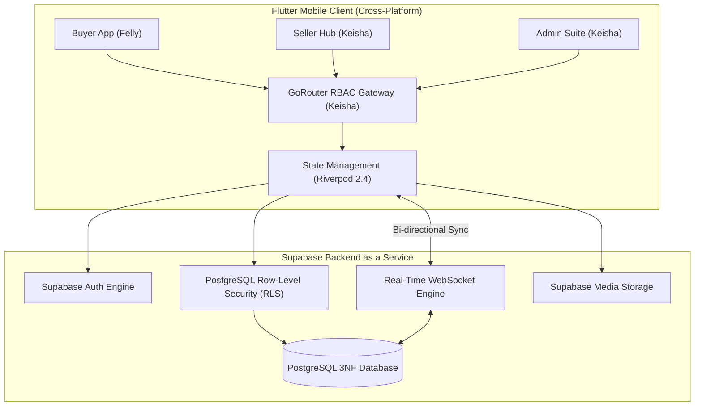

<div align="center">

# 🍽️ JAJANYUK — Campus Canteen Ecosystem
### *A Real-Time, Multi-Tenant Digital Canteen Platform for Universities*

[](https://flutter.dev)
[](https://dart.dev)
[](https://riverpod.dev)
[](https://pub.dev/packages/go_router)
[](https://supabase.com)
[](https://www.postgresql.org)
[](LICENSE)

<p align="center">
  <b>Eliminating canteen queues, synchronizing live merchant orders, and empowering university campus management through real-time technology.</b>
</p>

[System Architecture](#-system-architecture) •
[Team & Ownership Matrix](#-team-attribution--scope-matrix) •
[Lead Backend & Merchant/Admin Engineering](#-engineering-deep-dive-keishas-scope) •
[Features](#-feature-ecosystem) •
[Database & Security](#-database-design--security-3nf--rls) •
[Getting Started](#-getting-started)

---

</div>

## 📌 Executive Summary

**JAJANYUK** is an enterprise-grade mobile ecosystem engineered to streamline campus dining operations across multi-campus universities. Built with **Flutter**, **Riverpod**, and **Supabase (PostgreSQL)**, the platform replaces chaotic physical queueing with an interconnected trio of systems:
1. **Customer Mobile Application**: Fast food discovery, real-time carting, and contactless ordering for university students.
2. **Seller Real-Time Hub**: Live WebSocket-driven kitchen display system, instant inventory toggles, refund handling, and sales analytics.
3. **University Admin Suite**: Centralized governance over campus branches, merchant verification KYC, transaction audits, and access control.

---

## 👥 Team Attribution & Scope Matrix

JAJANYUK was developed collaboratively with clear separation of concerns, specialized domain ownership, and strict API/design contracts:

| Team Member | Primary Role | GitHub / Contact | Direct Scope & Deliverables |
| :--- | :--- | :--- | :--- |
| **Keisha** | **Lead Backend, Admin & Seller Hub Engineer** | [@wvionn](https://github.com/wvionn) | • **Core Data Architecture**: 3NF normalized schema, PostgreSQL triggers, composite indexing, and database functions.<br>• **Multi-Tenant Security**: Supabase Row-Level Security (RLS) policies isolating vendor & buyer data.<br>• **Admin Suite**: 5 full modules (Dashboard, Seller KYC Verification, Campus Manager, Audit/Transactions, User Management).<br>• **Seller Hub**: 7 core operational modules (Live WebSocket Orders, Menu & Out-of-Stock Toggle, Analytics/Reports, Real-Time Chat, Refunds, Profile).<br>• **Auth & Routing Gateway**: GoRouter RBAC engine with automatic claims-based routing. |
| **Aisyah** | **UI/UX Designer** | *UI/UX Specialist* | • **Design System**: Global typography, spacing tokens, color palette, and atomic UI component kit.<br>• **Interactive Prototypes**: High-fidelity Figma workflows for buyer ordering and merchant interaction.<br>• **User Experience Research**: User persona mapping, empathy tests, and canteen field discovery. |
| **Felly** | **Customer App Frontend Developer** | *Frontend Specialist* | • **Student Interface**: Home feed, categorized meal discovery, dynamic search, and campus filtering.<br>• **Cart & Checkout**: Riverpod-managed local basket, order summary calculations, and COD checkout.<br>• **Customer Flow**: Order tracking status UI, notification feeds, and user account management. |

---

## ⚙️ System Architecture

The application adopts **Clean Architecture** with a **Feature-First** structure, strictly separating Presentation, Domain, and Data layers to guarantee zero coupling between user roles.



---

## 💻 Engineering Deep Dive: Keisha's Scope (`@wvionn`)

As the **Lead Backend & Systems Engineer**, Keisha designed, architected, and built the complete backend infrastructure along with both non-customer mobile engines (**Admin Suite** and **Seller Hub**).

```
lib/features/
├── admin/                         # 🛡️ Dedicated Admin Suite (5 Modules)
│   ├── data/                      # Data Sources, Admin DTOs & Repositories
│   ├── domain/                    # Entities, Use Cases & Verification Contracts
│   └── presentation/pages/
│       ├── admin_dashboard_page.dart       # High-Level Metric Aggregations & KPIs
│       ├── admin_sellers_page.dart         # Merchant Approval & KYC Verification
│       ├── seller_registration_page.dart   # Onboard New Merchant Accounts
│       ├── admin_campuses_page.dart        # Multi-Campus CRUD & Building Allocations
│       ├── admin_transactions_page.dart    # System-Wide Financial Audit Logs
│       └── admin_users_page.dart           # User Roles & Access Governance
├── seller/                        # 🏪 Dedicated Seller Hub (7 Modules)
│   ├── data/                      # WebSocket Stream Sources & Mutation Repositories
│   ├── domain/                    # Order Processing, Financial & Menu Models
│   └── presentation/pages/
│       ├── seller_dashboard_page.dart      # Real-Time Daily Revenue & Status Cards
│       ├── seller_orders_page.dart         # Live Kitchen Orders via WebSocket
│       ├── seller_menu_page.dart           # Dynamic Menu Management & Sold-Out Toggles
│       ├── seller_reports_page.dart        # Daily/Weekly/Monthly Revenue Breakdown
│       ├── seller_chat_page.dart           # In-App Live Chat with Buyers per Order
│       ├── seller_returns_page.dart        # Dispute & Refund Claim Processing
│       └── seller_profile_page.dart        # Vendor Operational Hours & Outlets
└── auth/                          # 🔐 Role-Based Access Control & Routing Gateway
```

### 1. 🛡️ University Admin Suite (5 Modules)
* **Master Dashboard**: Real-time aggregated operational metrics (total revenue, active merchants, daily orders, multi-campus traffic).
* **Seller KYC & Verification**: In-depth review workflow allowing admins to approve/reject merchant applications and register official vendor accounts with automated credential provisioning.
* **Campus Manager**: Multi-tenant infrastructure management to register campuses, canteen buildings, and assign vendor stalls.
* **Audit & Transaction Ledger**: Financial monitoring and auditing across all platform orders with status breakdowns (Completed, Processing, Cancelled).
* **User Access Governance**: Global user registry managing role elevation (`customer` $\rightarrow$ `seller` $\rightarrow$ `admin`).

### 2. 🏪 Seller Real-Time Hub (7 Modules)
* **Live WebSocket Kitchen Orders**: Instant real-time order notifications and state updates (`pending` $\rightarrow$ `processing` $\rightarrow$ `ready` $\rightarrow$ `completed`) without polling.
* **Menu & Sold-Out Controller**: Instant menu editing, price modifications, category classification, and instantaneous `is_available` stock toggling.
* **Financial Analytics & Reports**: Automated calculations of gross sales, net revenue, daily order volumes, and historical revenue export feeds.
* **Order-Bound Real-Time Chat**: Live two-way communication channel between merchant and buyer linked directly to the order UUID.
* **Dispute & Refund Processing**: Dedicated return-management interface to review student cancellation and refund claims.
* **Merchant Profile & Schedule**: Configurable operating hours (`open_time` - `close_time`), stall status (`is_open`), and preparation time estimations.

### 3. 🔐 RBAC Auth Gateway & Auto-Redirection
* Enforces single-entry authentication via GoRouter redirect interceptors:
  * Users with role `admin` are routed directly to `/admin-dashboard`.
  * Users with role `seller` are routed directly to `/seller-dashboard`.
  * Students/buyers are routed to `/home` wrapped in the persistent `MainShell`.

---

## 🔒 Database Design & Security: 3NF & RLS

### 🗄️ Third Normal Form (3NF) Database Schema
The database architecture was normalized from raw canteen receipt structures (**UNF**) through **1NF** and **2NF** up to **3NF** to eliminate update/delete anomalies and minimize redundancy:

```
[campuses] 1 ──< [vendors] 1 ──< [menus] 1 ──< [order_items] >── 1 [orders]
                     │                                                   │
                     └── 1 ── [seller_profiles] 1 ── 1 [users] 1 ────────┘
                                                         │
                                                  [transactions]
```

* **`users`**: Central account identity, role designations, and campus bindings.
* **`campuses`**: Multi-campus registry (name, code, address, status).
* **`vendors`**: Merchant stalls, operating schedules, verification status, and stall locations.
* **`seller_profiles`**: 1:1 bridge linking Supabase `auth.users` to `vendors`.
* **`menus`**: Atomic items with price check constraints (`CHECK price >= 0`), category enums (`Makanan`, `Minuman`, `Snack`, `Lainnya`), and availability flags.
* **`orders` & `order_items`**: Decoupled order headers and itemized lines with full referential integrity (`ON DELETE CASCADE`).
* **`transactions`**: Payment verification logs and reconciliation timestamps.
* **`chat_messages`**: Real-time communication records indexed by `order_id`.

### 🛡️ Row-Level Security (RLS) Multi-Tenant Policies
Multi-tenancy and data isolation are strictly enforced at the PostgreSQL layer:
* **Vendors/Sellers**: Can only read and modify orders, menus, and reports matching their authenticated `vendor_id`.
* **Customers**: Can only read their own placed orders and profile details.
* **Admins**: Elevated bypass access using security definer functions for platform oversight.

---

## 🚀 Feature Ecosystem

```
JAJANYUK Platform
│
├── 🎓 Buyer Experience (Felly)
│   ├── Multi-Campus Canteen Selection
│   ├── Menu Search & Category Filtering (Foods, Drinks, Snacks)
│   ├── Dynamic Shopping Basket (Cart Calculation)
│   ├── Order Placement & Note Customization
│   └── Real-Time Order Status Tracking
│
├── 🏪 Seller Hub (Keisha)
│   ├── Real-Time Order Stream (Sound/Badge Alert & Status Steps)
│   ├── Instant Item Stock Toggle (Sold Out / Available)
│   ├── Menu Item Creation & Price Adjustment
│   ├── Live In-App Chat with Ordering Customer
│   ├── Revenue Tracking & Daily Performance Visualizations
│   └── Order Dispute & Refund Resolution
│
└── 🛡️ University Admin Suite (Keisha)
    ├── Platform-Wide Operational Dashboard
    ├── Merchant Onboarding & Credential Generation
    ├── Campus & Stall Registry Management
    ├── Financial Reconciliation & Transaction Ledger
    └── Role Management & System Diagnostics
```

---

## 🛠️ Tech Stack & Dependencies

```yaml
Framework & Core:
  - Flutter (v3.x / Dart v3.x)
  - Material 3 Design System

State Management & Routing:
  - flutter_riverpod: ^2.4.0   # Reactive, decoupled state management
  - go_router: ^12.0.0          # Declarative routing with RBAC guards

Backend as a Service (BaaS):
  - supabase_flutter: ^2.0.0   # Real-time WebSockets, PostgREST, Auth & Storage
  - PostgreSQL 15 (Supabase)   # 3NF Schema with Stored Procedures & RLS

Architecture & Utilities:
  - Clean Architecture (Data - Domain - Presentation)
  - flutter_dotenv: ^5.1.0      # Secure runtime environment variables
  - dartz: ^0.10.1              # Functional error handling (Either/Option)
  - equatable: ^2.0.5          # Value equality for state comparison
  - intl: ^0.18.1               # Indonesian Rupiah (IDR) & Date formatting
```

---

## 🏁 Getting Started

### Prerequisites
* [Flutter SDK](https://docs.flutter.dev/get-started/install) (>= 3.0.0)
* [Dart SDK](https://dart.dev/get-dart) (>= 3.0.0)
* A [Supabase](https://supabase.com) Project instance

### Installation & Local Setup

1. **Clone the repository**
   ```bash
   git clone https://github.com/wvionn/JAJANYUK.git
   cd JAJANYUK
   ```

2. **Install Flutter packages**
   ```bash
   flutter pub get
   ```

3. **Configure Environment Variables**
   Create a `.env` file in the root directory (or use `.env.example`):
   ```env
   SUPABASE_URL=https://your-project-id.supabase.co
   SUPABASE_ANON_KEY=your-anon-key-here
   ```

4. **Initialize Database Schema & RLS**
   * Navigate to your Supabase project's **SQL Editor**.
   * Run the SQL scripts in order:
     1. [`CLEAN_AND_SEED_DATABASE.sql`](CLEAN_AND_SEED_DATABASE.sql) — Initializes tables, 3NF foreign keys, triggers, and demo seed data.
     2. [`FIX_DATABASE_AND_RLS.sql`](FIX_DATABASE_AND_RLS.sql) — Deploys Row-Level Security policies for buyers, sellers, and administrators.

5. **Run the Application**
   ```bash
   # Debug mode on connected device or emulator
   flutter run
   ```

---

## 🧪 Testing & Quality Assurance

```bash
# Run unit & widget tests
flutter test

# Run static code analysis
flutter analyze
```

---

## 📄 License & Attribution

This project is licensed under the [MIT License](LICENSE).

Developed with pride for the university canteen community by:
* **Keisha** ([@wvionn](https://github.com/wvionn)) — *Lead Backend, Admin & Seller Hub Engineer*
* **Felly** — *Customer App Frontend Developer*
* **Aisyah** — *UI/UX Designer*

---

<div align="center">
  <sub>Built with ❤️ using Flutter & Supabase</sub>
</div>
