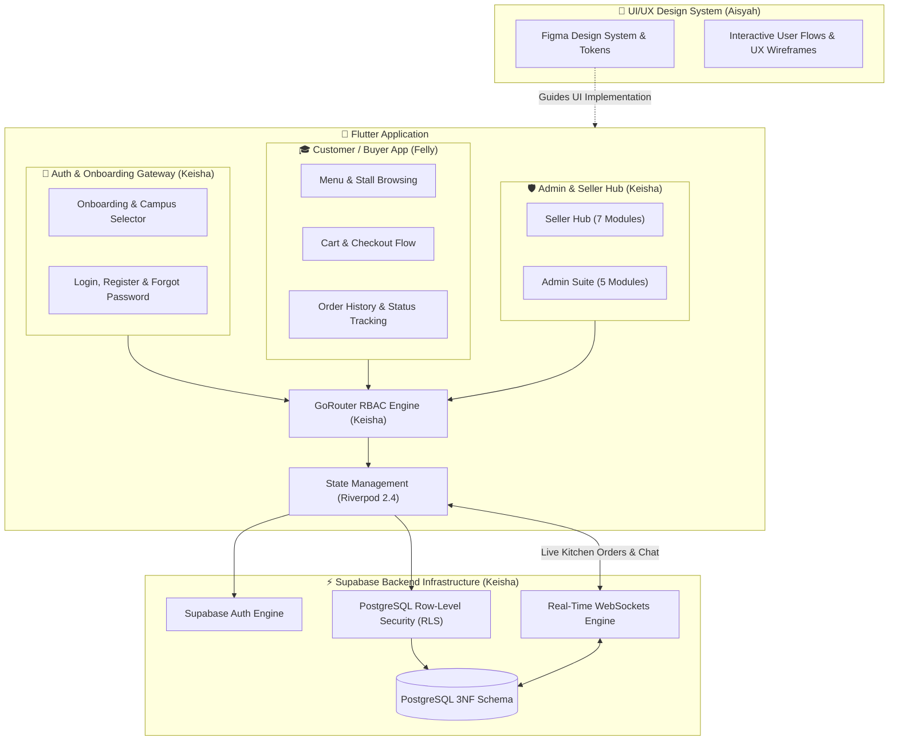

<div align="center">

# 🍽️ JAJANYUK — Campus Canteen Ecosystem
### *A Real-Time, Multi-Tenant Digital Canteen Platform for Universities*
#### 🎓 University Capstone Collaborative Project (Tugas Akhir)

[](https://flutter.dev)
[](https://dart.dev)
[](https://riverpod.dev)
[](https://pub.dev/packages/go_router)
[](https://supabase.com)
[](https://www.postgresql.org)
[](https://github.com/wvionn/JAJANYUK)
[](LICENSE)

<p align="center">
  <b>An end-to-end digital transformation for university canteens: eliminating physical queues for students, empowering food merchants with live kitchen management, and providing campus administrators with centralized operational governance.</b>
</p>

[Project Overview](#-project-overview) •
[Team & Ownership Matrix](#-team-contributions--ownership-matrix) •
[Domain Deep Dives](#-domain-breakdown--deliverables) •
[System Architecture](#-system-architecture) •
[Database & Security](#-database-design--security-3nf--rls) •
[Getting Started](#-getting-started)

---

</div>

## 📌 Project Overview

**JAJANYUK** is a collaborative university capstone project (**Tugas Akhir**) engineered to solve daily operational bottlenecks in university dining halls. Developed as a cross-functional initiative by a team of three students, the platform unifies three distinct user experiences into a cohesive, real-time ecosystem:

1. **🎓 Student / Buyer Mobile App**: Contactless meal discovery, fast carting, campus switching, and live order status tracking.
2. **🏪 Seller Real-Time Hub**: Live WebSocket kitchen display system, instant inventory/sold-out toggles, financial analytics, and in-app buyer communication.
3. **🛡️ Campus Admin Suite**: Centralized campus branch management, merchant KYC verification, transaction auditing, and role-based access control.

---

## 👥 Team Contributions & Ownership Matrix

This project was built collaboratively with dedicated domain ownership across UI/UX design, customer mobile frontend, and backend/auth/admin/merchant systems:

| Team Member | Core Domain | Responsibilities & Deliverables |
| :--- | :--- | :--- |
| **Aisyah** | **UI/UX Designer** | • **Design System & Visual Language**: Typography hierarchy, color palette, responsive grid, and reusable UI tokens.<br>• **Figma Prototyping**: High-fidelity wireframes and interactive flows for Buyer, Seller, and Admin interfaces.<br>• **User Research & UX Testing**: Student journey mapping, merchant empathy interviews, and canteen usability testing. |
| **Felly** | **Customer App Frontend Developer** | • **Food & Vendor Discovery**: Categorized meal navigation, merchant stall browsing, and live keyword search.<br>• **Cart & Checkout Engine**: Riverpod-powered reactive basket, item note additions, and cash/COD order placement.<br>• **Order & Account Management**: Live order status timeline, order cancellation flow, notification center, and customer profile page. |
| **Keisha** ([@wvionn](https://github.com/wvionn)) | **Lead Backend, Admin, Seller Hub & Auth/Onboarding Engineer** | • **Auth & Onboarding Gateway**: User onboarding walkthrough, campus selector, Login/Register/Forgot Password, and GoRouter RBAC auto-redirection.<br>• **Database & Cloud Architecture**: 3NF normalized schema, PostgreSQL triggers, composite indexing, and Supabase integration.<br>• **Data Security & Multi-Tenancy**: PostgreSQL Row-Level Security (RLS) isolating merchant, buyer, and administrative data.<br>• **Admin Suite (5 Modules)**: Operational Dashboard, Merchant KYC & Verification, Campus Manager, Financial Audit, and User Governance.<br>• **Seller Hub (7 Modules)**: Real-time WebSocket Order KDS, Menu & Stock Controller, Financial Analytics, Chat, Refunds, and Profile. |

---

## 🔍 Domain Breakdown & Deliverables

### 🎨 1. UI/UX Design & Research — *Led by Aisyah*
* **Design System & Component Kit**: Created a modern, accessible, and clean design system in Figma incorporating primary brand colors, typography scales, iconography, and structured spacing rules.
* **Student Journey Optimization**: Designed intuitive ordering flows minimizing clicks from canteen discovery to final checkout.
* **Merchant & Admin Workflow Ergonomics**: Designed high-density dashboards for kitchen operators and university administrators, prioritizing actionable cards, live badges, and streamlined verification steps.
* **Interactive Prototyping & Usability Testing**: Conducted user testing sessions with students and canteen stall owners to iterate on feedback and validate UI responsiveness.

---

### 🎓 2. Customer / Buyer Mobile Application — *Led by Felly*
* **Menu Browsing & Search**: Categorized food navigation (`Makanan`, `Minuman`, `Snack`, `Lainnya`), live text search, item descriptions, and price calculations.
* **Canteen Stall Discovery**: Browse available canteen stalls within the selected campus and view opening hours.
* **State-Managed Cart & Checkout**:
  * Reactive cart state powered by Riverpod.
  * Custom notes per item (e.g., "tidak pedas", "tanpa es").
  * Instant subtotal, service calculation, and order dispatch.
* **Order Tracking & Notifications**:
  * Visual status progression (`Menunggu Konfirmasi` $\rightarrow$ `Sedang Dimasak` $\rightarrow$ `Siap Diambil` $\rightarrow$ `Selesai`).
  * Order cancellation and dispute handling.
  * History log of completed and past transactions.
* **Customer Profile Page**: Personal profile and contact information management.

---

### 💻 3. Backend, Admin Suite, Seller Hub & Auth/Onboarding — *Led by Keisha ([@wvionn](https://github.com/wvionn))*

#### 🔐 Auth, Onboarding & Campus Gateway
* **Interactive Onboarding Walkthrough**: Multi-step animated onboarding introducing core platform features with smooth carousel navigation (`onboarding_page.dart`).
* **Campus Selection Gateway**: Initial campus picker allowing users to choose their active university branch (`campus_selection_page.dart`).
* **Authentication Suite**:
  * **Login & Registration**: Secure authentication forms with input validation, role checks, and password visibility toggles (`login_page.dart`, `register_page.dart`).
  * **Forgot Password**: Password reset recovery flow (`forgot_password_page.dart`).
* **GoRouter RBAC Interceptor**: Single-entry authentication routing users dynamically based on their role (`customer` $\rightarrow$ `/home`, `seller` $\rightarrow$ `/seller-dashboard`, `admin` $\rightarrow$ `/admin-dashboard`).

#### 🛡️ Campus Admin Suite (5 Modules)
* **Executive Dashboard**: Aggregated high-level metrics across all campus branches (total gross volume, daily orders, active merchants, and registered students).
* **Seller KYC & Verification**: In-depth review interface to approve/reject merchant stall registrations and provision official credentials.
* **Campus Manager**: Multi-campus registry for managing buildings, canteen locations, and stall assignments.
* **Audit & Transaction Ledger**: System-wide financial log auditing all orders and payment states.
* **User Governance**: Centralized user directory managing role elevations (`customer` $\leftrightarrow$ `seller` $\leftrightarrow$ `admin`).

#### 🏪 Seller Real-Time Hub (7 Modules)
* **Live WebSocket Kitchen Orders**: Instant real-time order stream with status state machines (`pending` $\rightarrow$ `processing` $\rightarrow$ `ready` $\rightarrow$ `completed`).
* **Menu & Stock Toggle**: Instant menu creation, price adjustments, and real-time `is_available` (Sold Out / Tersedia) toggles.
* **Financial Analytics & Reports**: Automatic daily, weekly, and monthly gross/net revenue calculations and order volume breakdowns.
* **Order-Bound Chat**: Real-time two-way messaging between merchant and student directly linked to the order ID.
* **Dispute & Refund Processing**: Dedicated return-management workflow to review and process student order cancellations.
* **Vendor Profile & Schedule**: Configuration of operational hours (`open_time` - `close_time`), stall status (`is_open`), and estimated prep time.

#### 🗄️ Database Architecture & Security
* **3NF Database Normalization**: Normalized data model eliminating anomalies across campuses, vendors, menus, orders, order items, and transactions.
* **PostgreSQL Row-Level Security (RLS)**: Strict database-level multi-tenant policies ensuring complete data privacy across vendors and buyers.

---

## ⚙️ System Architecture

The project follows **Clean Architecture** with a **Feature-First** organization, maintaining strict decoupling across presentation, domain, and data layers:



---

## 🔒 Database Design & Security: 3NF & RLS

### 🗄️ Relational Entity Architecture (3NF)

```
[campuses] 1 ──< [vendors] 1 ──< [menus] 1 ──< [order_items] >── 1 [orders]
                     │                                                   │
                     └── 1 ── [seller_profiles] 1 ── 1 [users] 1 ────────┘
                                                         │
                                                  [transactions]
```

* **`campuses`**: University branches and physical campus locations.
* **`vendors`**: Merchant stalls, operating hours, stall locations, and verification status.
* **`users` & `seller_profiles`**: Multi-role account registry with 1:1 vendor ownership bindings.
* **`menus`**: Atomic menu items with category constraints (`Makanan`, `Minuman`, `Snack`, `Lainnya`) and availability flags.
* **`orders` & `order_items`**: Decoupled transaction headers and itemized details with foreign key integrity.
* **`transactions`**: Payment verification logs and audit timestamps.
* **`chat_messages`**: Real-time order-bound conversation history.

---

## 🛠️ Tech Stack & Libraries

```yaml
Framework & UI:
  - Flutter (v3.x / Dart v3.x)
  - Material 3 Design System
  - Design Tokens & Figma Prototypes

State Management & Routing:
  - flutter_riverpod: ^2.4.0   # Reactive state management
  - go_router: ^12.0.0          # Declarative routing with RBAC guards

Backend & Cloud (BaaS):
  - supabase_flutter: ^2.0.0   # Real-time WebSockets, PostgREST, Auth & Storage
  - PostgreSQL 15 (Supabase)   # 3NF relational schema with RLS & Triggers

Core Utilities:
  - flutter_dotenv: ^5.1.0      # Environment variable management
  - dartz: ^0.10.1              # Functional error handling (Either/Option)
  - equatable: ^2.0.5          # Value equality for immutability
  - intl: ^0.18.1               # Indonesian Rupiah (IDR) & Date formatting
```

---

## 🏁 Getting Started

### Prerequisites
* [Flutter SDK](https://docs.flutter.dev/get-started/install) (>= 3.0.0)
* [Dart SDK](https://dart.dev/get-dart) (>= 3.0.0)
* A [Supabase](https://supabase.com) Project instance

### Local Installation

1. **Clone the Repository**
   ```bash
   git clone https://github.com/wvionn/JAJANYUK.git
   cd JAJANYUK
   ```

2. **Install Flutter Dependencies**
   ```bash
   flutter pub get
   ```

3. **Configure Environment Variables**
   Create a `.env` file in the root directory:
   ```env
   SUPABASE_URL=https://your-project-id.supabase.co
   SUPABASE_ANON_KEY=your-anon-key-here
   ```

4. **Initialize Database**
   * Open your Supabase **SQL Editor**.
   * Execute the database migration scripts to initialize the 3NF tables and Row-Level Security policies.

5. **Run the App**
   ```bash
   # Run on connected device / emulator
   flutter run
   ```

---

## 🧪 Testing & Code Quality

```bash
# Run unit & widget tests
flutter test

# Run static code analysis
flutter analyze
```

---

## 👥 Project Team & Credits

This project was created as a Collaborative Final Project / Capstone (**Tugas Akhir**) by:

* 🎨 **Aisyah** — *UI/UX Designer & Product Researcher*
* 🎓 **Felly** — *Customer / Buyer App Frontend Developer*
* 💻 **Keisha** ([@wvionn](https://github.com/wvionn)) — *Lead Backend, Admin Suite, Seller Hub & Auth/Onboarding Engineer*

---

<div align="center">
  <sub>🎓 University Capstone Project • Built with ❤️ using Flutter, Riverpod & Supabase</sub>
</div>
